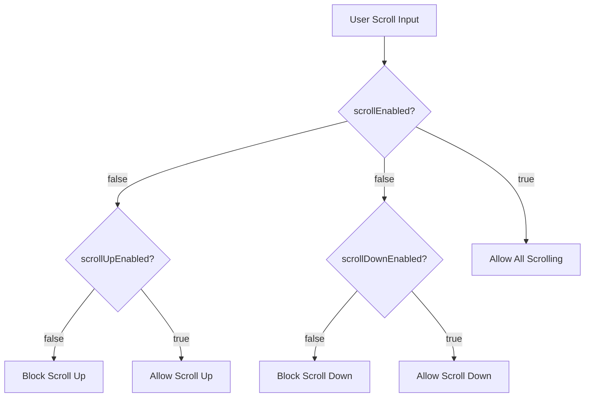

## Overview

The Sunflower Capital website uses `react-page-scroller` to create a full-page vertical scrolling experience with six distinct sections. The implementation includes custom scroll controls, dot navigation, and coordinated state management.

## ReactPageScroller Setup

The main page component wraps all sections in ReactPageScroller:

```tsx src/app/page.tsx
import ReactPageScroller from "react-page-scroller";

const App: React.FC = () => {
  const [currentPage, setCurrentPage] = useState(0);
  const [scrollEnabled, setScrollEnabled] = useState(true);
  const [scrollUpEnabled, setScrollUpEnabled] = useState(true);
  const [scrollDownEnabled, setScrollDownEnabled] = useState(true);

  const beforePageChange = (newPage: number) => {
    setCurrentPage(newPage);
  };

  return (
    <ReactPageScroller
      customPageNumber={currentPage}
      blockScrollUp={!scrollEnabled && !scrollUpEnabled}
      blockScrollDown={!scrollEnabled && !scrollDownEnabled}
      onBeforePageScroll={beforePageChange}
      renderAllPagesOnFirstRender={true}
    >
      {/* Page sections */}
    </ReactPageScroller>
  );
};
```

## Key Configuration Props

<ParamField path="customPageNumber" type="number" required>
  Current page index (0-5). Allows programmatic navigation via state.
</ParamField>

<ParamField path="blockScrollUp" type="boolean">
  Prevents scrolling to previous page. Calculated as `!scrollEnabled && !scrollUpEnabled`.
</ParamField>

<ParamField path="blockScrollDown" type="boolean">
  Prevents scrolling to next page. Calculated as `!scrollEnabled && !scrollDownEnabled`.
</ParamField>

<ParamField path="onBeforePageScroll" type="(newPage: number) => void">
  Callback fired before transitioning to a new page. Used to update `currentPage` state.
</ParamField>

<ParamField path="renderAllPagesOnFirstRender" type="boolean">
  When true, all pages render immediately for instant navigation. Improves perceived performance.
</ParamField>

<Warning>
  The scroll blocking logic uses AND conditions (`!scrollEnabled && !scrollUpEnabled`), meaning scrolling is only blocked when BOTH the master control is disabled AND the direction-specific control is disabled.
</Warning>

## Scroll Control Architecture

### Three-Tier Control System

The application implements a sophisticated scroll control system with three layers:

<Steps>
  <Step title="Master Control (scrollEnabled)">
    Global on/off switch for all scrolling behavior
  </Step>
  <Step title="Direction Controls">
    Separate flags for up (`scrollUpEnabled`) and down (`scrollDownEnabled`) scrolling
  </Step>
  <Step title="Component-Level Control">
    Child components can modify parent scroll state via callbacks
  </Step>
</Steps>

### Scroll Control Flow Diagram



## Page-Specific Scroll Logic

Certain pages require special scroll behavior:

### Portfolio Page (Index 3)

```tsx src/app/page.tsx
useEffect(() => {
  if (currentPage === 3) {
    setScrollUpEnabled(false)
    setScrollDownEnabled(false)
  }
}, [currentPage]);
```

<Info>
  When navigating to the portfolio page, both direction controls are disabled. This prevents accidental page changes while users browse the portfolio table.
</Info>

### PortfolioTable Scroll Management

The PortfolioTable component implements sophisticated scroll detection:

```tsx src/components/PortfolioTable.tsx
const handleScroll = () => {
  if (lastRowRef.current && tableBodyRef.current && firstRowRef.current) {
    let firstRect = firstRowRef.current.getBoundingClientRect()
    let lastRect = lastRowRef.current.getBoundingClientRect()
    let tableRect = tableBodyRef.current.getBoundingClientRect()
    
    if ((lastRect.bottom - 3) < tableRect.bottom) {
      // Scrolled to bottom
      setTimeout(() => {
        setScrollUpEnabled(false)
        setScrollDownEnabled(true)
      }, 500);
    } else if (firstRect.top === tableRect.top) {
      // Scrolled to top
      setTimeout(() => {
        setScrollDownEnabled(false)
        setScrollUpEnabled(true)
      }, 500);
    } else {
      // Middle position
      setScrollDownEnabled(false)
      setScrollUpEnabled(false)
    }
  }
};
```

<Accordion title="Scroll Detection Logic Explained">
  The table tracks three scroll positions:
  
  1. **At Top**: When the first row aligns with table top, enable down-scrolling to navigate away
  2. **At Bottom**: When the last row is visible (with 3px tolerance), enable up-scrolling to navigate away
  3. **Middle**: When scrolling within the table, disable both directions to prevent page navigation
  
  The 500ms delay prevents immediate re-enabling during scroll momentum.
</Accordion>

### Mouse and Touch Event Handling

```tsx src/components/PortfolioTable.tsx
<div
  className="flex flex-col w-full h-[60vh] sm:h-[70vh] overflow-y-auto"
  onMouseEnter={() => setScrollEnabled(false)}
  onMouseLeave={() => setScrollEnabled(true)}
  onTouchStart={() => setScrollEnabled(false)}
  onTouchEnd={() => setScrollEnabled(true)}
  ref={tableBodyRef}
>
```

<CodeGroup>
```tsx Desktop Events
onMouseEnter={() => setScrollEnabled(false)}
onMouseLeave={() => setScrollEnabled(true)}
```

```tsx Mobile Events
onTouchStart={() => setScrollEnabled(false)}
onTouchEnd={() => setScrollEnabled(true)}
```
</CodeGroup>

## Dot Navigation System

The DotNavigator component provides visual feedback and click navigation:

```tsx src/components/DotNavigator.tsx
interface DotNavigatorProps {
  currentScreen: number;
  onDotClick: (index: number) => void;
  isMobile: boolean;
}

const DotNavigator: React.FC<DotNavigatorProps> = ({ 
  currentScreen, 
  onDotClick, 
  isMobile 
}) => {
  const totalScreens = 6;

  return (
    <div className={`dot-container flex gap-2 p-4 rounded-full 
      transition-all duration-1000 ${
        currentScreen === 0 || currentScreen === 5 
          ? 'bg-dark-green' 
          : ''
      }`}
    >
      {Array.from({ length: totalScreens }).map((_, index) => {
        const dotClass = (() => {
          if (currentScreen === index) {
            return 'scale-150 opacity-100';
          } else if ((currentScreen === 0 || currentScreen === 5) 
                     && currentScreen !== index) {
            return 'scale-100 hover:scale-125 opacity-20';
          } else {
            return 'scale-100 hover:scale-125 opacity-50';
          }
        })();

        return (
           onDotClick(index)}
          />
        );
      })}
    </div>
  );
};
```

### Dot Navigation Features

<CardGroup cols={2}>
  <Card title="Dynamic Styling" icon="palette">
    Background changes on hero (0) and footer (5) pages
  </Card>
  <Card title="Scale Animation" icon="arrows-maximize">
    Active dot scales to 150%, others to 100%
  </Card>
  <Card title="Opacity States" icon="eye">
    Active: 100%, Inactive: 50%, Hero/Footer: 20%
  </Card>
  <Card title="Click Navigation" icon="hand-pointer">
    Direct navigation to any page via dot click
  </Card>
</CardGroup>

### Conditional Rendering

```tsx src/app/page.tsx
{!mobile && 
  <DotNavigator 
    currentScreen={currentPage} 
    onDotClick={beforePageChange} 
    isMobile={isMobile} 
  />
}
```

<Note>
  The dot navigator only renders on desktop devices. Mobile users navigate solely through swipe gestures.
</Note>

## CSS Positioning

The dot navigator uses fixed positioning:

```css globals.css
.dot-container {
  right: 20px;
  position: fixed; 
  top: 50%;
  transform: translateY(-50%);
  display: flex;
  flex-direction: column;
  align-items: center;
  gap: 30px; 
  z-index: 1000;
}

.dot {
  width: 14px;
  height: 14px;
  border-radius: 50%;
  cursor: pointer;
  transition: background-color 0.3s ease, opacity 0.3s ease, transform 0.3s ease;
}
```

## Page Sections Structure

Each section is a direct child of ReactPageScroller:

<Tabs>
  <Tab title="Section 0: Hero">
    ```tsx
    <div id="hero" className="landscape:h-screen portrait:h-[calc(100dvh)]">
      {/* Animated sunflower garden */}
    </div>
    ```
  </Tab>
  <Tab title="Section 1: Statement">
    ```tsx
    <div id="statement1" className="h-[calc(100dvh)]">
      {/* Mission statement */}
    </div>
    ```
  </Tab>
  <Tab title="Section 2: Ethos">
    ```tsx
    <div id="statement2" className="h-[calc(100dvh)]">
      {lg ? <Ethos /> : /* Mobile version */}
    </div>
    ```
  </Tab>
  <Tab title="Section 3: Portfolio">
    ```tsx
    <div id="portfolio" className="min-h-[calc(100dvh)]">
      <PortfolioTable
        setScrollEnabled={setScrollEnabled}
        setScrollUpEnabled={setScrollUpEnabled}
        setScrollDownEnabled={setScrollDownEnabled}
        isMobile={isMobile}
      />
    </div>
    ```
  </Tab>
  <Tab title="Section 4: Testimonials">
    ```tsx
    <div id="testimonials" className="min-h-[calc(100dvh)]">
      <Testimonials setScrollEnabled={setScrollEnabled} />
    </div>
    ```
  </Tab>
  <Tab title="Section 5: Footer">
    ```tsx
    <div id="footer" className="min-h-[calc(100dvh)]">
      {/* Contact info and social links */}
    </div>
    ```
  </Tab>
</Tabs>

<Info>
  All sections use `h-[calc(100dvh)]` or `min-h-[calc(100dvh)]` to ensure full viewport height, with `dvh` (dynamic viewport height) accounting for mobile browser UI.
</Info>

## Global Overflow Control

Prevents default page scrolling:

```css globals.css
html, body {
  background: #03351A;
  overflow: hidden;
  height: 100%;
  margin: 0;
  padding: 0;
}
```

<Warning>
  Setting `overflow: hidden` on html/body is critical. Without it, native browser scrolling would conflict with ReactPageScroller.
</Warning>

## Programmatic Navigation

To navigate programmatically, update the `currentPage` state:

```tsx
const goToPortfolio = () => {
  setCurrentPage(3);
};
```

ReactPageScroller responds to `customPageNumber` changes and animates to the new page.

## Best Practices

<AccordionGroup>
  <Accordion title="Scroll Control Coordination">
    Always provide callback props (`setScrollEnabled`, etc.) to components with scrollable content to prevent navigation conflicts.
  </Accordion>
  
  <Accordion title="Mobile Optimization">
    Use touch events (`onTouchStart`/`onTouchEnd`) in addition to mouse events for proper mobile scroll control.
  </Accordion>
  
  <Accordion title="Performance">
    Set `renderAllPagesOnFirstRender={true}` to preload all sections and enable instant navigation.
  </Accordion>
  
  <Accordion title="Height Management">
    Use `calc(100dvh)` instead of `100vh` to account for mobile browser chrome and ensure true full-height sections.
  </Accordion>
</AccordionGroup>

## Related Resources

<CardGroup cols={2}>
  <Card title="Architecture Overview" icon="sitemap" href="/architecture/overview">
    High-level application structure
  </Card>
  <Card title="Responsive Design" icon="mobile" href="/architecture/responsive-design">
    Mobile and desktop patterns
  </Card>
</CardGroup>